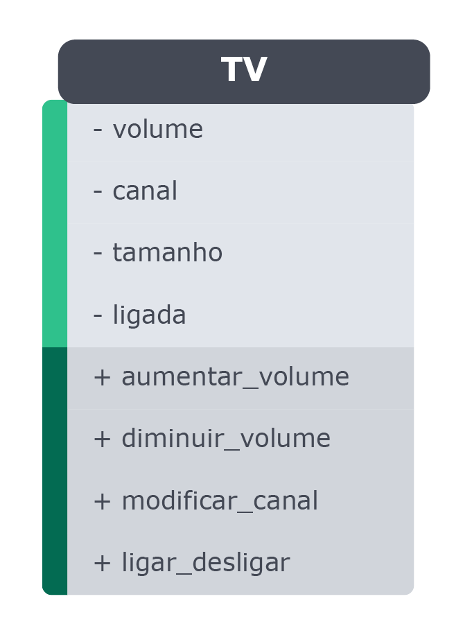
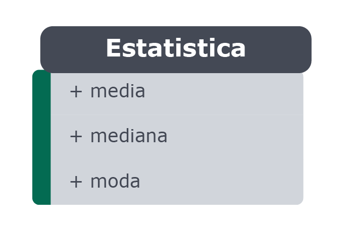
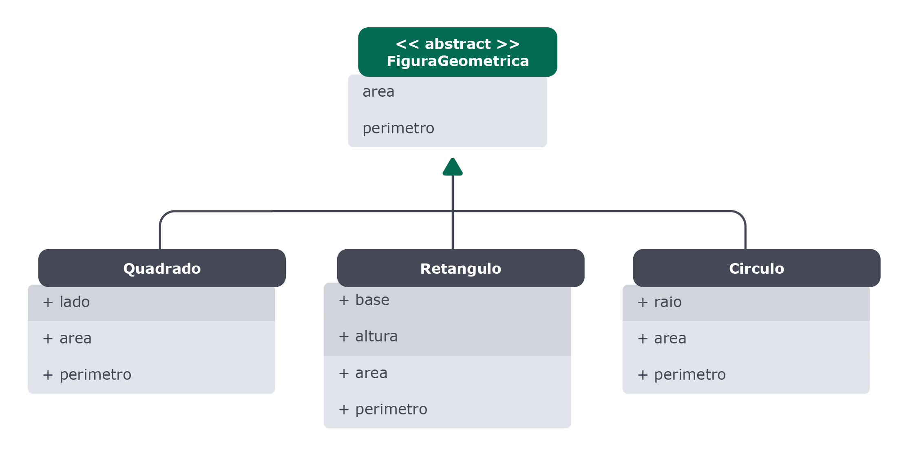

# P.O.O in Python

### 🚀 [Exercício 1](./exercise01.py): Vamos implementar o diagrama abaixo:

Atributos:

- `volume` - será inicializado com um valor de 50 e só pode estar entre 0 e 99;

- `canal` - será inicializado com um valor de 1 e só pode estar entre 1 e 99;

- `tamanho` - será inicializado com o valor do parâmetro;

- `ligada` - será inicializado com o valor de `False`, pois está inicialmente desligado.

Todos os atributos devem ser privados.

Métodos:

- `aumentar_volume` - aumenta o volume de 1 em 1 até o máximo de 99;

- `diminuir_volume` - diminui o volume de 1 em 1 até o mínimo de 0;

- `modificar_canal` - altera o canal de acordo com o parâmetro recebido e deve lançar uma exceção (`ValueError`) caso o valor esteja fora dos limites;

- `ligar_desligar` - alterna o estado da TV entre ligado e desligado (True/False).

### [Exercício 2](./exercise02.py): Defina uma classe `Estatistica` que calcule média, mediana e moda de uma lista de números.
🐦 Dica: Utilize métodos de classe.

### [Exercício 3](./exercise03.py): Implementar os objetos das seguintes figuras geométricas

